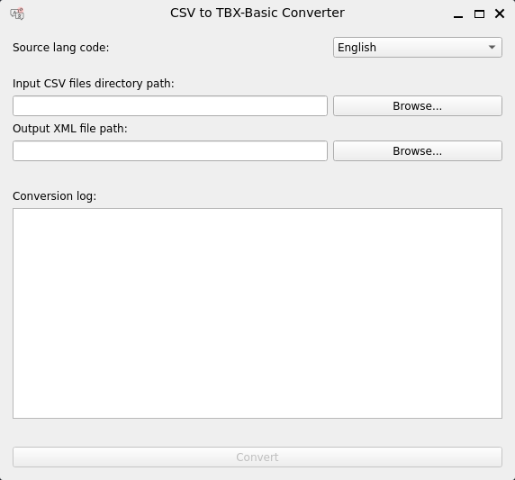

# Simple CSV to TBX-Basic Converter



## Introduction
This converter accepts a folder containing multiple simple CSV glossaries and
converts them into a single TBX-Basic file.

A few assumptions are made about the CSV glossaries:

1. They only contain two columns: 
   - source language terms
   - target language terms
2. The first column across all files represents the same source language (_i.e._, if English 
   is the source language, all of the CSV files have English terms in the first column).
3. Each of the files beings with the target language name (and region in parentheses if applicable)
   in their title (_e.g._, "Spanish_Glossary.csv", "Portuguese (Brazil)_Glossary.csv", etc.).

## Running
To run this tool:

1. Clone the repository: 
```shell
user> git clone https://github.com/BYU-TRG-Team/py-Convert-SimpleCSV-TBX-Basic.git
```
2. (optional but recommended) Create and use a Python [virtual environment](https://docs.python.org/3/library/venv.html)
3. Install dependencies: 
```shell
user> pip install -r requirements.txt
```
4. Run the tool:
``` shell
user> python main.py
```

## Using the Converter

1. Select source language.
2. Select the folder containing the CSV files.
3. Choose an output file.
4. Click "Convert"
